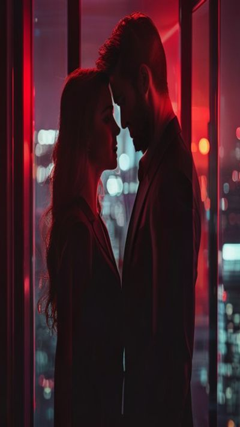

# AI ASSET GENERATION PROMPTS — Agentsflix
## Complete prompts for generating all photos, GIFs, and videos

---

## 📸 HERO BACKGROUND VIDEO (1920×1080, 15-20s loop, MP4)

**Prompt for Runway Gen-3 / Pika / Kling / Luma Dream Machine:**
> Cinematic vertical mobile frame, dark moody lighting, micro-drama scene: two attractive people in tense emotional moment, CEO and assistant in modern glass office at night, city lights behind them, CEO leans close whispering secret, assistant looks shocked, cliffhanger expression. 9:16 aspect ratio, Netflix-style color grading, teal/orange cinematic lighting, shallow depth of field, 4K, slow subtle camera push-in, loopable 15-second clip, no text, pure atmosphere.

**Negative prompt:** bright lighting, happy expressions, cartoon, illustration, text, watermark, UI elements, horizontal orientation, blurry, low quality

---

## 🎬 DEMO VIDEO (1280×720, 30s, MP4)

**Prompt:**
> Split-screen demo of Agentsflix app: left side shows iPhone 15 Pro recording app interaction, right side shows same content on web. Sequence: 1) App opens to vertical feed, thumb swipes up - instant episode load (<100ms), 2) Episode plays - CEO romance drama, cliffhanger at 58s, "Next episode" auto-plays, 3) Creator dashboard - AI script generator typing "enemies to lovers CEO romance", 4) Smart editor - auto-cuts to beat, adds dynamic captions, 5) Analytics - retention curve 78%, revenue $3,495. Clean UI, smooth transitions, upbeat background music, 30fps, 1080p.

---

## 🖼️ SHOWCASE THUMBNAILS (400×711 each, 9:16, PNG)

### Thumb #1: "The CEO's Secret" — Romance
> Vertical 9:16 micro-drama poster, romance genre: handsome CEO in tailored suit, beautiful assistant in professional attire, standing close in modern office at night, city lights through floor-to-ceiling windows, intense eye contact, CEO's hand near assistant's face, tension palpable, soft romantic lighting with red accent rim light, Netflix thumbnail style, bold typography space at bottom, 4K, cinematic color grading

### Thumb #2: "Midnight Revenge" — Thriller
> Vertical 9:16 thriller poster: mysterious figure in dark hoodie standing on rain-slicked rooftop at midnight, city skyline behind, lightning illuminates face partially, holding evidence folder, intense determined expression, dark blue/black color palette with single red accent (blood drop on folder), cinematic noir lighting, high contrast, Netflix thriller aesthetic

### Thumb #3: "Dragon's Heir" — Fantasy
> Vertical 9:16 fantasy poster: young warrior with glowing magical sword standing before ancient dragon, reincarnation theme - modern clothes but ancient power, mystical energy swirling around, floating runes, dramatic lighting from dragon's eyes, deep purple/blue gradient background with gold accents, epic scale, cultivation/isekai aesthetic, high fantasy Netflix style

### Thumb #4: "Time Loop Love" — Romance/Sci-Fi
> Vertical 9:16 romantic sci-fi poster: same couple in three different eras overlapping - 1920s ballroom, 1980s neon cafe, 2024 modern office, connected by red string of fate, clock gears dissolving into hearts in background, time distortion visual effects, warm romantic lighting with cool blue time accents, emotional, mind-bending, Netflix original style

### Thumb #5: "Royal Escape" — Historical
> Vertical 9:16 historical drama poster: princess in ornate traditional robes running through palace corridor at night, lantern light casting dramatic shadows, palace guards in pursuit behind, determined expression, ornate architecture details, deep red/gold color palette, cinematic lighting, epic scale, palace intrigue, Netflix historical drama aesthetic

---

## 🎨 OG IMAGE (1200×630, PNG)

**Prompt:**
> Social media card for Agentsflix: dark cinematic background with subtle red radial gradient, bold title "Drama in 60 Seconds" with gradient text (white to red), subtitle "The first streaming platform built for micro-dramas", four stat pills: "50K+ Creators" "2M+ Episodes" "70% Revenue Share" "$4.99 Premium", CTA button "Join 50K+ Waitlist →" in Netflix red, app store badges (iOS, Android, Web), domain "agentsflix.com" at bottom. Clean, high contrast, shareable on Twitter/LinkedIn.

---

## 🏪 APP STORE BADGES (SVG → PNG)

### App Store Badge
> Clean Apple App Store badge: "Download on the App Store" with Apple logo, black background, white text, official Apple style, 300×100px

### Google Play Badge
> Clean Google Play badge: "Get it on Google Play" with Play logo, black background, white/green text, official Google style, 300×100px

---

## 🎞️ GIF PREVIEWS (for landing page hover states)

### GIF 1: Swipe Feed Interaction (400×711, 3-5s loop)
> Screen recording of Agentsflix app: vertical feed, thumb swipes up, next episode loads instantly, plays 3 seconds, auto-advances, smooth 60fps, vertical 9:16, 3-second seamless loop

### GIF 2: Cliffhanger Moment (400×711, 4s)
> Episode playing: dramatic scene, CEO whispers "I've been lying to you", assistant gasps, screen cuts to black with "Next episode in 3... 2... 1...", auto-plays next, vertical, 4s loop

### GIF 3: Creator Dashboard (600×400, 5s)
> Creator studio view: AI script generator typing, smart editor auto-cutting, analytics updating in real-time, revenue counter ticking up, horizontal format, 5s loop

### GIF 4: Earnings Calculator (400×300, 4s)
> Interactive calculator: sliders moving (episodes, views, engagement, subs), result numbers animating up ($1,240 → $3,495), horizontal, 4s loop

---

## 🎯 AI TOOL RECOMMENDATIONS

| Asset Type | Best Tool | Settings |
|------------|-----------|----------|
| Hero Video | Runway Gen-3 Alpha / Kling 1.6 | 15s, 9:16, cinematic, 4K |
| Demo Video | Runway Gen-3 + manual edit | 30s, 16:9, screen recording style |
| Thumbnails | Midjourney v6.1 / DALL-E 3 | 9:16, --style raw --stylize 750 |
| OG Image | DALL-E 3 / Ideogram 2.0 | 1200×630, text rendering |
| GIFs | Runway Gen-3 (image-to-video) | 3-5s, 9:16, loop |
| App Badges | Manual (official assets) | - |

---

## 📋 MIDJOURNEY PARAMETERS FOR THUMBNAILS

```
--ar 9:16 --style raw --stylize 750 --v 6.1 --quality 2 --no text watermark logo ui buttons horizontal blur low-quality cartoon illustration
```

**Example full prompt for Midjourney:**
```
/imagine prompt: Vertical 9:16 micro-drama poster, romance genre: handsome CEO in tailored suit, beautiful assistant in professional attire, standing close in modern office at night, city lights through floor-to-ceiling windows, intense eye contact, CEO's hand near assistant's face, tension palpable, soft romantic lighting with red accent rim light, Netflix thumbnail style, bold typography space at bottom, 4K, cinematic color grading --ar 9:16 --style raw --stylize 750 --v 6.1 --quality 2
```

---

## 🎬 RUNWAY GEN-3 PROMPTS FOR VIDEOS

### Hero Video (15s):
```
A cinematic vertical video (9:16) of a tense romantic moment between a CEO and his assistant in a modern glass office at night. City lights visible through floor-to-ceiling windows. The CEO leans in close, whispering a secret. The assistant looks shocked and captivated. Teal and orange cinematic color grading. Shallow depth of field. Slow subtle camera push-in. Netflix-style production quality. 4K. Loopable 15-second clip. No text, no UI.
```

### Demo Video Segments (generate separately, edit together):
1. **App Open & Swipe**: "iPhone 15 Pro screen recording: Agentsflix app opens to vertical feed, thumb swipes up, next episode loads instantly (<100ms), smooth 60fps"
2. **Cliffhanger Play**: "Episode playing: dramatic CEO romance scene, at 58s dramatic reveal, screen cuts to 'Next episode in 3... 2... 1...' auto-plays next"
3. **Creator Tools**: "Desktop recording: Creator dashboard, AI script generator types 'enemies to lovers CEO romance', smart editor auto-cuts to beat, adds dynamic captions"
4. **Analytics**: "Creator analytics: retention curve 78%, revenue counter $3,495, real-time updating"

---

## 📦 DELIVERY CHECKLIST

- [ ] Hero video: `assets/hero-video.mp4` (1920×1080, 15s, <5MB)
- [ ] Hero poster: `assets/hero-video-poster.jpg` (1920×1080)
- [ ] Demo video: `assets/demo-video.mp4` (1920×1080, 30s, <10MB)
- [ ] Demo poster: `assets/demo-poster.jpg` (1920×1080)
- [ ] Thumb 1: `assets/thumb-1.jpg` (400×711)
- [ ] Thumb 2: `assets/thumb-2.jpg` (400×711)
- [ ] Thumb 3: `assets/thumb-3.jpg` (400×711)
- [ ] Thumb 4: `assets/thumb-4.jpg` (400×711)
- [ ] Thumb 5: `assets/thumb-5.jpg` (400×711)
- [ ] OG Image: `assets/og-image.jpg` (1200×630)
- [ ] App Store badge: `assets/badge-appstore.png` (300×100)
- [ ] Google Play badge: `assets/badge-googleplay.png` (300×100)
- [ ] GIF 1 (swipe): `assets/gif-swipe.gif` (400×711)
- [ ] GIF 2 (cliffhanger): `assets/gif-cliffhanger.gif` (400×711)
- [ ] GIF 3 (creator): `assets/gif-creator.gif` (600×400)
- [ ] GIF 4 (calculator): `assets/gif-calculator.gif` (400×300)

---

## 🔄 REPLACEMENT INSTRUCTIONS

Once generated, replace the SVG placeholders in `index.html`:

```html
<!-- Hero video -->
<video class="hero-video" autoplay muted loop playsinline poster="assets/hero-video-poster.jpg">
  <source src="assets/hero-video.mp4" type="video/mp4">
</video>

<!-- Demo video -->
<video class="demo-video" id="demoVideo" poster="assets/demo-poster.jpg">
  <source src="assets/demo-video.mp4" type="video/mp4">
</video>

<!-- Thumbnails -->

<!-- ... etc -->

<!-- OG Image -->
<meta property="og:image" content="https://agentsflix.com/assets/og-image.jpg">

<!-- App badges -->


```

---

## 💡 PRO TIPS

1. **Batch generate thumbnails** in Midjourney using `--repeat 5` with slight prompt variations
2. **Use Runway's "Director Mode"** for consistent character across video segments
3. **Upscale with Topaz Gigapixel** or Magnific AI for 4K quality
4. **Compress videos with HandBrake** (H.265, CRF 23, slow preset) for web delivery
5. **Test on mobile** - vertical video must look perfect on iPhone/Android
6. **A/B test thumbnails** - generate 3 variants per show, test CTR